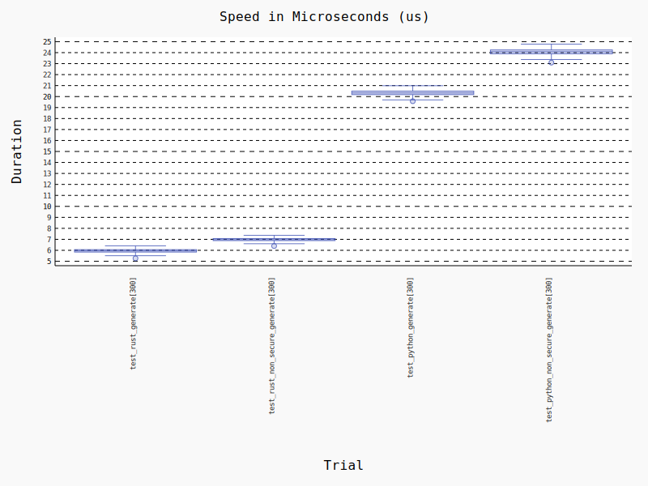

# PyNanoID

[](https://github.com/astral-sh/ruff)
[](https://github.com/arunanshub/pynanoid)
[](https://pypi.org/project/pynanoid)


A tiny, secure, URL-friendly, unique string ID generator for Python, written in
Rust.

- **Safe.** It uses hardware random generator. Can be used in clusters.
- **Fast.** 2-3 times faster than Python based generator.
- **Compact.** It uses a larger alphabet than UUID (`A-Za-z0-9_-`). So ID size
  was reduced from 36 to 21 symbols.

## Installation

```shell-session
$ pip install pynanoid
```

## Usage

```python
from pynanoid import generate

print(generate())
```

Symbols `-,.()` are not encoded in the URL. If used at the end of a link they
could be identified as a punctuation symbol.

The Rust based high-performance generator is used by default if available. You
can also use pure-Python based generator as shown [here](#force-use-pure-python-generator).

> [!NOTE]
> If Rust based implementation is not available, the pure-Python
> generator will be automatically used.

If you want to reduce ID length (and increase the probability of collisions),
you can pass the length as an argument.

```python
from pynanoid import generate

print(generate(size=10))
```

Don’t forget to check the safety of your ID length in ID [collision probability
calculator](https://zelark.github.io/nano-id-cc/).

### Custom Alphabet or Length

If you want to change the ID's alphabet or length, you can pass the alphabet as
the first argument and the size as the second argument.

```python
from pynanoid import generate

print(generate("1234567890abcdef", 10))
```

Non-secure generator is also available.

```python
from pynanoid import non_secure_generate

print(non_secure_generate())
```

> [!WARNING]
> Non-secure generator uses `random.random` internally. Hence it is not
> recommended for generating tokens or secrets.

### Force Use Pure-Python Generator

If you want to use the pure-Python generator, you can use functions provided in
`pynanoid.nanoid`.

```python
from pynanoid.nanoid import generate, non_secure_generate

print(generate())
print(non_secure_generate())
```

## Benchmarks



We benchmark using
[pytest-benchmark](https://pytest-benchmark.readthedocs.io/en/latest/).  You can
find the benchmark script in the `tests/` directory.

You can run the benchmarks using the following command:

```shell-session
$ pytest tests/benchmark.py --benchmark-histogram=assets/benchmark.svg
```

## Credits

- Andrey Sitnik for [Nano ID](https://github.com/ai/nanoid).
- Paul Yuan ([@puyuan](https://github.com/puyuan)) for
  [py-nanoid](https://github.com/puyuan/py-nanoid).
